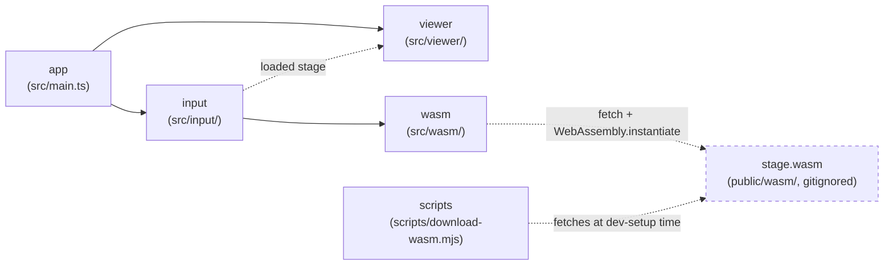

> Generated by /vibe:docs — manual edits will be overwritten; use README for hand-written content.

# Architecture

## Big picture

`stage-viewer-web` is a static, backend-less site. All stage `.def`
parsing happens client-side, in the browser, through a WebAssembly module
built from the sibling [`stage`](https://github.com/openkakutou/stage) Go
library — this repo never reimplements `.def` parsing itself.

- **`app`** (`src/main.ts`, `src/version.ts`, `src/style.css`) — the entry
  point. Builds the root layout: the org's shared `@openkakutou/web-ui-kit`
  app shell (a toolbar plus a main content region), mounts the `input`
  module's view into the main content, and wires its `onLoaded` callback
  to render the `viewer` module's characteristics panel into a container
  appended right after it. No sidebar/tabs slotted yet —
  `<wuik-app-shell>` collapses empty named slots to zero size with no
  reserved gutter, so this isn't broken-looking chrome.
- **`input`** (`src/input/`) — the stage folder input (backlog item 002).
  `folder-entries.ts` gathers files from a folder selection or a
  drag-and-drop, from either browser entry point, flattening any nested
  subfolders. `stage-file-input.ts` picks which gathered file is the
  stage's own `.def` (auto if there's exactly one, otherwise the caller
  must ask the user), reads and loads it through `wasm`, then resolves the
  `.def`'s referenced sprite sheet from that same folder listing by
  filename — see "Sprite sheet resolution" below.
  `stage-file-input-view.ts` renders the folder-picker + drag-and-drop UI
  and the multi-candidate/error/success states on top of that logic.
- **`wasm`** (`src/wasm/`) — the bridge to the `stage` WebAssembly module.
  `bridge.ts` loads `wasm_exec.js` and instantiates `stage.wasm`
  client-side (both fetched from `public/wasm/`, gitignored — see
  "WebAssembly dependency" below), then exposes a typed `loadStage(...)`
  wrapper around the module's `OpenKakutouStage.load` global. This app is
  read-only, so `OpenKakutouStage.save` (the module's write path, used by
  `stage-editor`) is never called here. `types.ts` is the TypeScript
  mirror of the module's JSON contract (`StageData` and its nested
  shapes) — pure data types, no parsing logic.
- **`scripts`** (`scripts/download-wasm.mjs`) — dev-only tooling, not part
  of the shipped app bundle. Fetches a pinned `stage` release's
  `stage.wasm` + `wasm_exec.js` into `public/wasm/` so contributors don't
  need a Go toolchain or a sibling `stage` checkout.
- **`viewer`** (`src/viewer/`) — the screens that show what was loaded.
  `characteristics-panel.ts` (backlog item 003) is the first one: it
  renders the loaded stage's name, author, camera bounds, and stage
  boundaries. A missing name or author renders as the literal text
  "Unknown" rather than a blank field. `topBound`/`bottomBound` are always
  shown, alongside an explicit note on whether the stage is 2D or 3D,
  derived from `bgDef.modelFile` being empty or not — never from the
  boundary values themselves, since a 2D stage's zero bounds are a value
  that happens to be zero, not evidence of dimensionality — see
  `.vibe/decisions/002-stage-boundaries-shown-unconditionally-with-dimension-note.md`.
  It appears inline automatically once a stage loads, with no tab/sidebar
  navigation yet, since it's still the only viewer screen.

## WebAssembly dependency

`public/wasm/` (the `stage.wasm` binary and its `wasm_exec.js` loader) is
fetched, never committed — see `docs/development.md` for how to fetch it
locally. Once fetched, `wasm/bridge.ts` loads `wasm_exec.js` by executing
its source via `new Function(source)()` rather than a `<script>` tag or
`import()`, so the same loading code behaves identically in a real browser
and under the test suite's jsdom environment — the same loading strategy
`character-viewer-web`'s own bridge uses (see that repo's
`.vibe/decisions/002-wasm-bridge-loading-and-result-shape.md`).

## Sprite sheet resolution

A stage's `.def` references its sprite sheet by a path string
(`stage.bgDef.spriteFile`) that real-world files write inconsistently —
bare filename, relative path, backslash separators, and sometimes a
different letter case than the file actually has on disk. `input`
resolves it by basename only (any directory prefix/separator stripped),
trying an exact match against the gathered folder listing first, then a
case-insensitive fallback — see
`.vibe/decisions/001-sprite-sheet-resolved-by-basename-with-case-insensitive-fallback.md`
for the full reasoning and the real-corpus evidence (`character`'s own
`.vibe/backlog/done/050-...case-sensitively.md`) backing the fallback.
More than one file matching the resolved name is reported as ambiguous
rather than silently picking one.

## Data flow: loading a stage

1. The user picks or drops a folder onto `input`'s view.
2. `input` gathers every file in it (recursing into subfolders), then
   picks the `.def` candidate — automatically if there's exactly one,
   otherwise the view prompts the user to choose among them.
3. The chosen `.def`'s bytes are read and handed to `wasm.loadStage`,
   which calls the WebAssembly module's `OpenKakutouStage.load` and parses
   its `{ stage, error }` JSON result into a typed `StageResult`. A stage
   with no BG elements comes back with `elements: null` (not `[]`) — a nil
   Go slice marshals to JSON `null`, which `StageData`'s own type reflects
   rather than hiding.
4. Once the stage loads, `input` resolves its referenced sprite sheet from
   the same gathered folder listing (see "Sprite sheet resolution" above)
   and reads its bytes too.
5. `input`'s view reports success (stage + sprite sheet bytes) or a
   specific, named failure (which file, and why) back to the caller —
   never a thrown exception at any layer. On success, `app` renders the
   `viewer` module's characteristics panel with the loaded stage. Other
   viewer screens (a BG element/layer browser, a visual preview renderer)
   land in later items.
