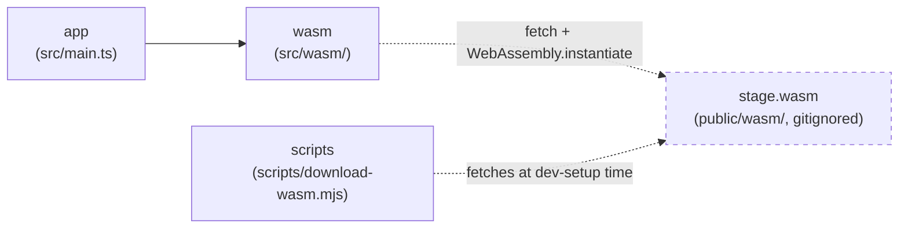

> Generated by /vibe:docs — manual edits will be overwritten; use README for hand-written content.

# Architecture

## Big picture

`stage-viewer-web` is a static, backend-less site. All stage `.def`
parsing happens client-side, in the browser, through a WebAssembly module
built from the sibling [`stage`](https://github.com/openkakutou/stage) Go
library — this repo never reimplements `.def` parsing itself.

- **`app`** (`src/main.ts`, `src/version.ts`, `src/style.css`) — the entry
  point. Builds the root layout: the org's shared `@openkakutou/web-ui-kit`
  app shell, a toolbar (app title + version) plus an empty main content
  region, ready for the file input and viewer screens that later backlog
  items add. No sidebar/tabs slotted yet — `<wuik-app-shell>` collapses
  empty named slots to zero size with no reserved gutter, so this isn't
  broken-looking chrome.
- **`wasm`** (`src/wasm/`) — the bridge to the `stage` WebAssembly module.
  `bridge.ts` loads `wasm_exec.js` and instantiates `stage.wasm`
  client-side (both fetched from `public/wasm/`, gitignored — see
  "WebAssembly dependency" below), then exposes a typed `loadStage(...)`
  wrapper around the module's `OpenKakutouStage.load` global. This app is
  read-only, so `OpenKakutouStage.save` (the module's write path, used by
  `stage-editor`) is never called here. `types.ts` is the TypeScript
  mirror of the module's JSON contract (`StageData` and its nested
  shapes) — pure data types, no parsing logic. Nothing in `app` calls
  `loadStage` yet; that lands with the file input (backlog item 002).
- **`scripts`** (`scripts/download-wasm.mjs`) — dev-only tooling, not part
  of the shipped app bundle. Fetches a pinned `stage` release's
  `stage.wasm` + `wasm_exec.js` into `public/wasm/` so contributors don't
  need a Go toolchain or a sibling `stage` checkout.

## WebAssembly dependency

`public/wasm/` (the `stage.wasm` binary and its `wasm_exec.js` loader) is
fetched, never committed — see `docs/development.md` for how to fetch it
locally. Once fetched, `wasm/bridge.ts` loads `wasm_exec.js` by executing
its source via `new Function(source)()` rather than a `<script>` tag or
`import()`, so the same loading code behaves identically in a real browser
and under the test suite's jsdom environment — the same loading strategy
`character-viewer-web`'s own bridge uses (see that repo's
`.vibe/decisions/002-wasm-bridge-loading-and-result-shape.md`).

## Data flow: loading a stage (once the file input lands)

1. `loadStage` is called with a stage `.def` file's raw bytes.
2. On first call, the bridge fetches and instantiates `stage.wasm` (memoized
   — later calls skip straight to step 3).
3. The bytes are handed to the WebAssembly module's `OpenKakutouStage.load`,
   which returns a `{ stage, error }` JSON result — never throws, even on
   malformed input.
4. `loadStage` parses that into a typed `StageResult`: `{ ok: true, stage }`
   or `{ ok: false, error }`. A stage with no BG elements comes back with
   `elements: null` (not `[]`) — a nil Go slice marshals to JSON `null`,
   which `StageData`'s own type reflects rather than hiding.
